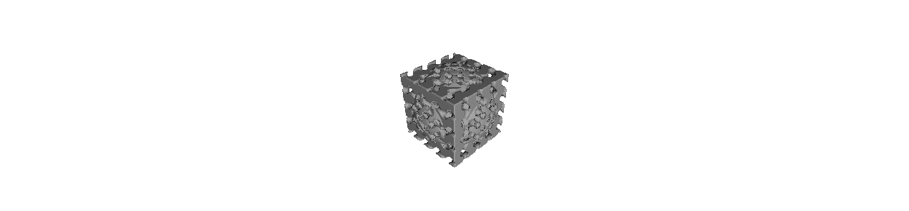
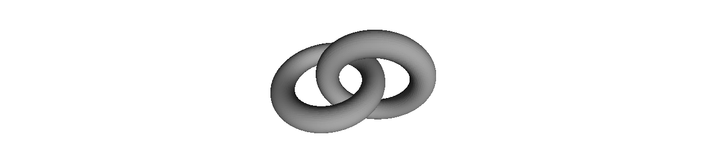
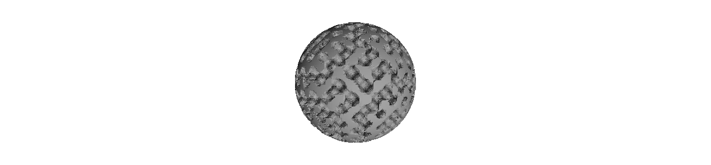
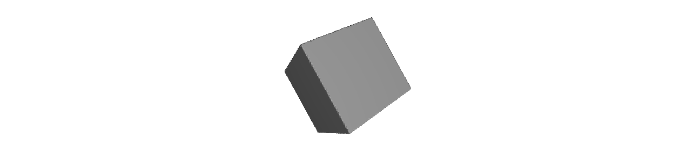

# GeomKernel: High-Performance SDF Geometry Kernel

[](https://en.cppreference.com/w/cpp/20)
[](https://opensource.org/licenses/MIT)

A modern, high-performance, header-only C++ library for **Signed Distance Function (SDF)** based geometry modeling. Designed for precision engineering, physics-informed structure design, and advanced manufacturing (WAAM/AM).

---

## Key Features

- **Engineering Precision**: Uses `double` (64-bit float) for all geometric calculations.
- **Microstructures & Lattices**: Optimized kernels for **TPMS** (Gyroid, Diamond, Schwarz P).
- **Smooth Booleans**:Controllable polynomial and exponential blending for continuous gradients.
- **Transformation Matrix**: Full `Mat4` support for translation, rotation, and non-uniform scaling.
- **High-Performance Meshers**: Multi-threaded Marching Cubes and Dual Contouring.
- **Voxelization & Sparse Grids**: Support for dense `VoxelGrid` and memory-efficient `SparseVoxelGrid`.
- **Differentiable Template Engine**: Exact analytical gradients and Hessians via nested forward-mode Automatic Differentiation (Dual Numbers).
- **Parameter Exposure**: Unified parameter API (`getParam`, `setParam`, `evalParamD`) for generic multiphysics optimization.
- **External Data**: Convert Point Clouds and Meshes (STL/OBJ) directly into SDFs.

---

## Architecture

`GeomKernel` represents geometry as a continuous scalar field where the value at any point `p` indicates the distance to the nearest surface:
- $f(p) < 0$: Inside the object
- $f(p) > 0$: Outside the object
- $f(p) = 0$: Surface interface

### Primary Components:
- **`SDF`**: Abstract base class for all signed distance functions.
- **`Primitives`**: Standard leaf nodes for the CSG tree.
- **`Booleans`**: Union, Intersection, and Difference operations.
- **`Meshers`**: High-performance Dual Contouring and Marching Cubes implementation for high-quality mesh generation from SDF fields.

---

## Quick Start

### 1. Integration (Git Submodule)

Add `GeomKernel` to your project's `extern` directory:

```bash
git submodule add https://github.com/your-org/geom-kernel extern/geom-kernel
```

In your `CMakeLists.txt`:

```cmake
add_subdirectory(extern/geom-kernel)
target_link_libraries(your_project PRIVATE GeomKernel)
```

### 2. Basic Example

Creating a simple box with a spherical cutout:

```cpp
#include "GeomKernel/Primitives.h"
#include "GeomKernel/Booleans.h"
#include <memory>

int main() {
    using namespace Geom;

    // 1. Define primitives
    auto box = std::make_shared<Box>(Point3(0,0,0), Vec3(10, 10, 10)); // 20x20x20 box
    auto sphere = std::make_shared<Sphere>(Point3(0,0,0), 12.0);      // r=12 sphere

    // 2. Perform Boolean operations
    auto result = std::make_shared<Difference>(box, sphere);

    // 3. Evaluate distance at a point
    Scalar dist = result->eval(Point3(5, 5, 5));
    
    return 0;
}
```

## Automatic Differentiation & Evaluation

GeomKernel uses a generic `SDFNode<Derived>` / `FieldNode<Derived>` CRTP architecture that natively supports Forward-Mode Automatic Differentiation via Dual numbers.

```cpp
// 1. Evaluate Scalar Distance
Scalar dist = result->eval(Point3(5, 5, 5));

// 2. Evaluate Gradient (Analytical Normal * Length)
Vec3 grad = result->gradient(Point3(5, 5, 5));

// 3. Evaluate Hessian Matrix (Curvature / 2nd-order derivatives)
Field::enableHessian = true; // Toggle for heavy compute
Mat3 hess = result->hessian(Point3(5, 5, 5));
```

---

## Performance & Showcase

GeomKernel is optimized for high-throughput geometric evaluation. In our latest benchmark (Gallery Showcase), the kernel achieved **~3.5 Million triangles per second** on a standard consumer CPU (multi-threaded).

### Showcase Results


*Gyroid intersection with a Box.*


*SmoothUnion of two interlocking Toruses.*


*Diamond TPMS intersection with a Sphere.*


*Box with non-orthogonal composite transformation.*

| Shape | Triangles | Meshing Time | Feature Used |
|---|---|---|---|
| **Gyroid Lattice** | 490,264 | 0.165s | TPMS + Intersection |
| **Smooth Chain** | 161,820 | 0.057s | Torus + SmoothUnion + Transform |
| **Diamond Ball** | 557,535 | 0.155s | TPMS + Intersection |
| **Transformed Box** | 3,780 | 0.003s | Mat4 Rotation + Box |

*Environment: Release build, 64-bit, multi-threaded on 8 cores.*

## License

This project is licensed under the MIT License - see the [LICENSE](LICENSE) file for details.
