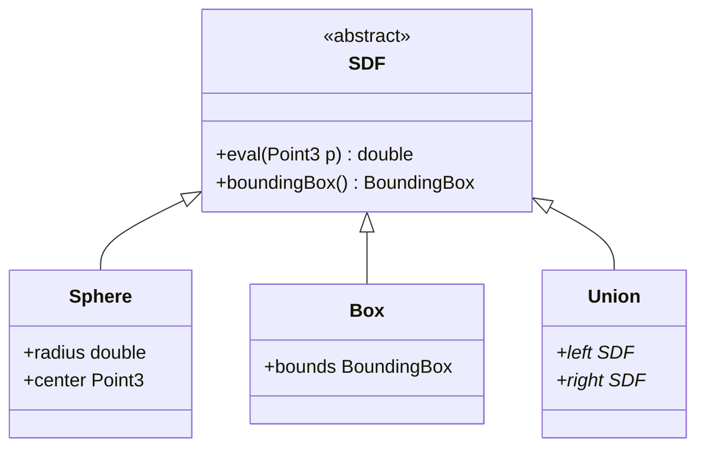

# SDF Geometry Kernel Architecture

## 1. Coordinate System & Units
- **handedness**: Right-handed (X-Right, Y-Forward, Z-Up)
- **units**: Millimeters (mm)
- **precision**: `double` (64-bit float) for all geometric calculations. `float` may be used for visualization meshes only.

## 2. Core Representation
The kernel represents geometry as a **Signed Distance Function (SDF)**.
- $f(p) < 0$: Inside
- $f(p) > 0$: Outside
- $f(p) = 0$: Surface

## 3. Class Hierarchy (Planned)

## 4. Memory Management
- The kernel uses `std::shared_ptr<SDF>` for constructing trees.
- DAGs (Directed Acyclic Graphs) are allowed (instancing).
- Nodes are immutable after creation where possible to allow thread-safe evaluation.

## 5. Error Handling
- Exceptions are used for invalid geometry construction.
- `NaN` checks are enforced at leaf node evaluation.
